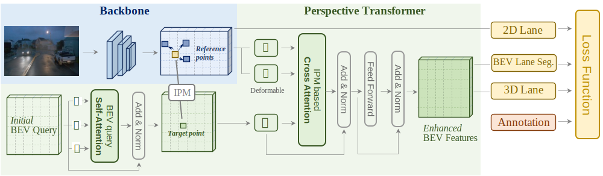

# PersFormer
  

> **PersFormer: 3D Lane Detection via Perspective Transformer and the OpenLane Benchmark**  
> Li Chen∗†, Chonghao Sima∗, Yang Li∗, Zehan Zheng, Jiajie Xu, Xiangwei Geng,  Hongyang Li†, Conghui He, Jianping Shi, Yu Qiao, Junchi Yan.
>  
> ∗ equal contributions.  
> † corresponding authors           
> [arXiV 2203.11089](https://arxiv.org/abs/2203.11089)

## Introduction
This repository is the PyTorch implementation for **PersFormer**.  

PersFormer is an end-to-end monocular 3D lane detector with a novel Transformer-based spatial feature transformation module. Our model generates BEV features by attending to related front-view local regions with camera parameters as a reference. It adopts a unified 2D/3D anchor design and an auxiliary task to detect 2D/3D lanes simultaneously, enhancing the feature consistency and sharing the benefits of multi-task learning.
  
- [Changelog](#changelog)
- [Get Started](#get-started)
  - [Installation](#installation)
  - [Dataset](#dataset)
  - [Training and evaluation](#training-and-evaluation)
- [Benchmark](#benchmark)
- [Visualization](#visualization)
- [Citation](#citation)
- [Acknowledgements](#acknowledgements)
- [License](#license)  
  
## Changelog
**2022-5-9:** We updated the model code and pretrained checkpoint which achieved **0.49** F1-score result of 3D lane detection on [OpenLane](https://github.com/OpenPerceptionX/OpenLane) Dataset.  
2022-5-9: We compared our method on [ONCES_3DLanes](https://github.com/once-3dlanes/once_3dlanes_benchmark) Dataset, where PersFormer also **outperforms** other methods.  
2022-4-12: We released the v1.0 code for PersFormer.  

## Get Started
  
### Installation
- To run PersFormer, make sure you are using a machine with **at least** one GPU.
- Please follow [INSTALL.md](docs/INSTALL.md) to setup the environment.
  
### Dataset
- Please refer to [OpenLane](https://github.com/OpenPerceptionX/OpenLane) for downloading OpenLane Dataset.
- Please refer to [Gen-LaneNet](https://github.com/yuliangguo/Pytorch_Generalized_3D_Lane_Detection) for downloading Apollo 3D Lane Synthetic Dataset.

### Training and evaluation 
- Please follow [TRAIN_VAL.md](docs/TRAIN_VAL.md) to train and evaluate the model.

## Benchmark
  - 3D Lane Detection Results (**F-Score**) in [OpenLane](https://github.com/OpenPerceptionX/OpenLane).
  
| Method     | All  | Up & Down | Curve | Extreme Weather | Night | Intersection | Merge& Split |  
| :----:     |:----:|:----:|:----:|:----:|:----:|:----:|:----:|  
| GenLaneNet | 29.7 | 24.2 | 31.1 | 26.4 | 17.5 | 19.7 | 27.4 |  
| 3DLaneNet  | 40.2 | 37.7 | 43.2 | 43.0 | 39.3 | 29.3 | 36.5 |  
|**PersFormer**|**47.8**|**42.4**|**52.8**|**48.7**|**46.0**|**37.9**|**44.6**|  
  
  - 2D Lane Detection Results (**F-Score**) in [OpenLane](https://github.com/OpenPerceptionX/OpenLane). Note that the baseline of 2D branch in PersFormer is **LaneATT**.
  
| Method     | All  | Up& Down | Curve | Extreme Weather | Night | Intersection | Merge& Split |
| :----:     |:----:|:----:|:----:|:----:|:----:|:----:|:----:|
| LaneATT-S  | 28.3 | 25.3 | 25.8 | 32.0 | 27.6 | 14.0 | 24.3 | 
| LaneATT-M  | 31.0 | 28.3 | 27.4 | 34.7 | 30.2 | 17.0 | 26.5 | 
| PersFormer | 42.0 | 40.7 | 46.3 | 43.7 | 36.1 | 28.9 | 41.2 |  
| CondLaneNet-S | 52.3 | 55.3 | 57.5 | 45.8 | 46.6 | 48.4 | 45.5 | 
| CondLaneNet-M | 55.0 | 58.5 | 59.4 | 49.2 | 48.6 | 50.7 | 47.8 | 
|**CondLaneNet-L**|**59.1**|**62.1**|**62.9**|**54.7**|**51.0**|**55.7**|**52.3**| 
  
  - 3D Lane Detection Results in [ONCE_3DLanes](https://github.com/once-3dlanes/once_3dlanes_benchmark).
  
| Method     | F1(%)  | Precision(%) | Recall(%) | CD error(m) |  
| :----:     |:----:|:----:|:----:|:----:|  
| 3DLaneNet  | 44.73 | 61.46 | 35.16 | 0.127 |  
| GenLaneNet | 45.59 | 63.95 | 35.42 | 0.121 |  
| SALAD ([paper](https://arxiv.org/pdf/2205.00301.pdf) of ONCE 3DLanes )     | 64.07 | 75.90 | 55.42 | 0.098 |  
|**PersFormer**|**74.33**|**80.30**|**69.18**|**0.074**|  
  

## Visualization
Following are the visualization results of PersFormer on OpenLane dataset and Apollo dataset.
- OpenLane visualization results  
  
- Apollo 3D Synthetic visualization results  
  
  

## Citation
  Please use the following citation if you find our repo or our paper [PersFormer](https://arxiv.org/abs/2203.11089) useful:

    @article{chen2022persformer,
      title={PersFormer: 3D Lane Detection via Perspective Transformer and the OpenLane Benchmark},
      author={Chen, Li and Sima, Chonghao and Li, Yang and Zheng, Zehan and Xu, Jiajie and Geng, Xiangwei and Li, Hongyang and He, Conghui and Shi, Jianping and Qiao, Yu and Yan, Junchi},
      journal={arXiv preprint arXiv:2203.11089},
      year={2022}
    }  

## Acknowledgements
  We would like to acknowledge the great support from SenseBee labelling team at SenseTime Research, and the fruitful discussions and comments for this project from Zhiqi Li, Yuenan Hou, Yu Liu. We thank for the code implementation from [Gen-LaneNet](https://github.com/yuliangguo/Pytorch_Generalized_3D_Lane_Detection), [LaneATT](https://github.com/lucastabelini/LaneATT) and [Deformable DETR](https://github.com/fundamentalvision/Deformable-DETR). 

## License
  All code within this repository is under [Apache License 2.0](https://www.apache.org/licenses/LICENSE-2.0).
